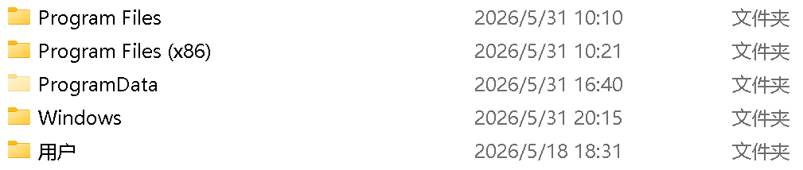

## 1. C盘当中的各文件夹作用

1. **Program Files（64 位软件安装目录）**
  作用：存放64 位应用程序的完整安装文件。
  你的系统是 64 位 Windows，原生 64 位软件（新版浏览器、设计软件、游戏、SolidWorks 等）默认装在这里。
  内部包含软件的主程序 exe、插件、资源文件、驱动等，软件运行必须依赖这里的文件。
  注意：不要手动删除、修改里面文件，会直接导致软件打不开、报错。
2. **Program Files (x86)（32 位软件兼容目录）**
  作用：存放32 位旧版软件，是 64 位系统的兼容文件夹。
  很多老程序、旧版工具、部分驱动、小型行业软件只有 32 位版本，安装时会自动放进这个文件夹。

3. **ProgramData（软件公共配置缓存文件夹，默认隐藏）**
核心定位：所有用户共用的软件数据，不存软件本体
存储内容：软件的全局配置、许可证文件、激活信息、缓存资源、更新包、模板、日志、插件库。
比如 SolidWorks 的激活数据、Office 全局模板、杀毒软件病毒库都存在这里。

4. **Windows 文件夹**
   系统本体，Windows 开机、运行、更新全部依赖这里，是最重要的文件夹。
   内部关键子目录：
   System32：64 位系统核心库、系统工具、驱动、命令程序（cmd、注册表、控制面板程序全在这）
   SysWOW64：32 位系统运行库，兼容老程序
   WinSxS：系统更新备份库，占空间很大，可以用系统自带磁盘清理清理更新缓存，不要手动删文件
   Fonts：电脑全部字体文件，删除字体这里会丢失文字显示
   Temp：系统临时文件，里面全部文件可以放心删除
   禁忌：整个文件夹不要动，除了Temp临时文件、磁盘清理工具。

5. **用户（Users）文件夹**
   存放每一个电脑登录账号的私人数据，你的桌面、文档、下载、图片、软件个人配置全在这里。
   举个例子：你电脑登录的账号叫「世明 - 个人」，对应文件夹就在C:\用户\世明-个人，里面包含：
   桌面、下载、文档、图片、视频、音乐
   AppData（隐藏文件夹）：软件私人配置、缓存、登录记录、存档
   AppData\Local：本地缓存，可清理缓存文件夹
   AppData\Roaming：软件账号配置、存档，删了软件会重置登录信息
   公共：所有用户共用的文档、桌面文件

## 2.C盘清理思路

1. 在安装软件时把安装路径放到D盘

2. 应用内把应用缓冲数据路径改到D盘

3. 把users下的桌面，文档，下载，图片路径变更成D盘

4. 定期用火绒垃圾清理工具清理缓冲文件

5. 使用SpaceSniffer工具查看文件占用